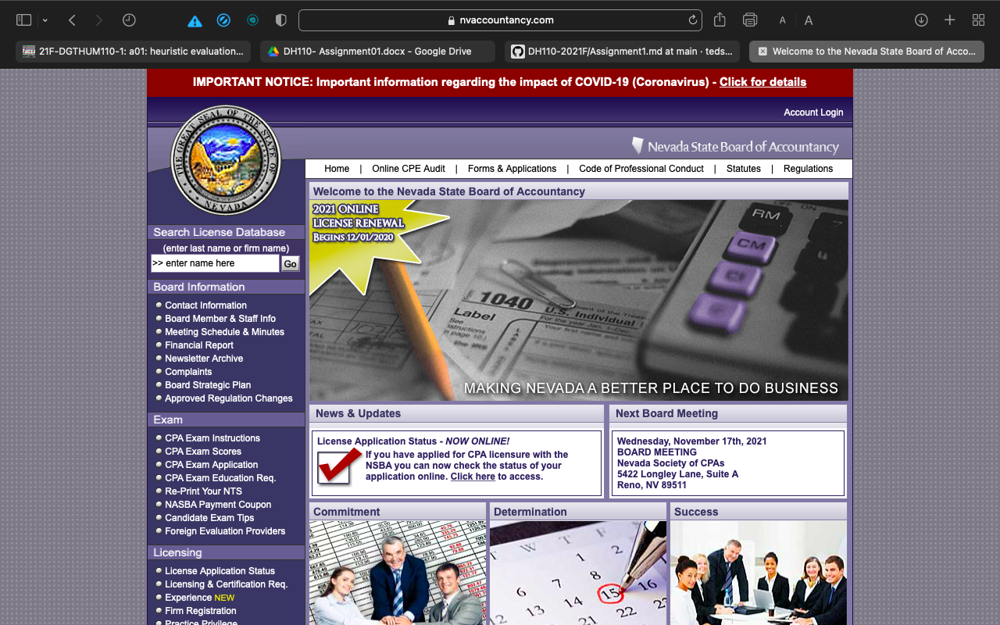

# Tentative: Government Websites for the Elderly
  ### Ted Song | Digital Humanities 110: User Experience and Design

## Assignment 1: Heuristic Evaluation

## Description
  The project intends to examine how suitable government websites are for people aged 65+ years old. Two government websites will be used. Through this project, I hope to examine the problems in government websites that make them inaccessible to the elderly and to find solutions to such problems.
  
  The present assignment will apply the 10 Usability Heuristics to analyze the problems that the two government websites have and to evaluate the usability of the websites.

## Introducing the 10 Usability Heuristics
  ### 1. Visibility of System Status
  - Users need to be provided information about the current status. Users also need to receive feedback if an action is committed.
  
  ### 2. Match Between the System and the Real World
  - The design should easily make sense to the user. This involves the use of words and concepts that are already familiar to the user.
    
  ### 3. User Control and Freedom
  - Users should be allowed to make mistakes. This involves a design that enables the user to cancel an action and re-attempt.
    
  ### 4. Consistency and Standards
  - Words and concepts that are used should be consistent with the words and concepts used on other digital platforms.
    
  ### 5. Error Prevention
  - Designers should make sure that there are no error-prone conditions and that warnings are provided when an action is performed.

  ### 6. Recognition Rather Than Recall
  - The design of the interface should be oriented toward users' recognition rather than their recall.

  ### 7. Flexibility and Efficiency of Use
  - Shortcuts should be provided, making it easier for already experienced users to navigate--although the design should also be usable for inexperienced users as well.

  ### 8. Aesthetic and Minimalist Design
  - "Less is more." Designers should remove unnecessary details.

  ### 9. Help Users Recognize, Diagnose, and Recover from Errors
  - Users should be provided a comprehensible error message and be suggested a solution.

  ### 10. Help and Documentation
  - In the case that users need extra help, help documentation should be easily noticeable and should provide steps that help the user perform an action.

## Website 1: [Nevada Gaming Commission and Gaming Control Board](https://gaming.nv.gov/index.aspx?page=1)
  ### Description
  The Nevada Gaming Commission and Gaming Control Board is responsible for enforcing policies and laws that help to regulate gaming in the state of Nevada. Their website provides information about laws, regulations, licenses, and news regarding gaming in Nevada.
  
  
 
 ### Overall Evaluation
 Overall, the website struggles with satisfying the 10 usability heuristics. Primarily, the site needs to organize its link better and should undergo a redesign because of its potential to confuse users easily.
 
 ### Heuristic Evaluation
 #### 1. Visibility of System Status (Severity Rating: 1)
 - When the user hovers over a certain menu feature, the feature darkens. This feedback is a major plus because it informs the user that the menu feature can be clicked and will direct to another site.
 - The search bar is not really helpful because, when the user types words or phrases, there are no suggestions, leaving the user confused as to whether their topic of interest is searchable. To solve this, I would recommend to provide suggestions as the user types in the search bar.

 #### 2. Match Between the System and the Real World (Severity Rating: 3)
 - The menu of the website uses common, familiar phrases like "About Us", "Gaming Commission", "Divisions", and "Human Resources", which are a plus because users will be easily able to navigate the website.
 - However, a severe problem is that a link in one menu option directs the user to the other menu option. For example, a link listed under "Gaming Commission" is also under "Divisions", which will confuse the user since they will not know which menu option is correct for certain links. I would recommend organizing the links correctly.

#### 3. User Control and Freedom (Severity Rating: 3)
- As mentioned in the problem in Heuristic #2, some links direct the user to another menu option. For example, clicking "Commission Meeting" under "Gaming Commission" option directs the user to "About Us" page. So, if the user mistakingly clicks on another link, the menu bar on the left side will show a page, making it difficult and confusing to go to the desired page. I would recommend organizing links correctly and placing them under the correct menu option.

#### 4. Consistency and Standards (Severity Rating: 1)
- The share, feedback, print button on some pages of the website is consistent in other platforms, which makes the website usable and somewhat familiar.
- Although the icons may look a bit outdated, the website is still usable because word descriptions are provided. I would still recommend updating icons to look more modern.

#### 5. Error Prevention (Severity Rating: 2)
- Clicking on "Americans with Disabilities Act" link directs the user to a different website on a new tab. A user may accidentally click this link, so I would recommend displaying a pop-up box that warns the user that they will be leaving the Gaming Commission and Gaming Control Board site.

#### 6. Recognition Rather Than Recall (Severity Rating: 3)
- Some of the sites under one menu option will be listed under a different menu option, as described in Heuristic #2 and #3, which forces the user to recall where sites are. To solve this, I would recommend organizing links better and put them under the correct menu options.

#### 7. Flexibility and Efficiency of Use (Severity Rating: 2)
- There are some shortcuts like "Contact Us", which is at the top of the site. However, the site is pretty much the same experience for both novices and experts of the site. I would suggest including more shortcut options for the experts.

#### 8. Aesthetic and Minimalist Design (Severity Rating: 3)
- The site appears rather simple at first, but it is more complicated to use. First, there are two menu bars (one at the top of the screen and one at the left side), which will overwhelm users as to which menu bar to use. I would suggest removing the one on the side and only use one menu bar.
- Another problem is that the site uses very tiny font size, which makes the site inaccessible for general users because it is so hard to read. I would suggest to use a bigger font size.
- Also, the sites have a lot of text, which can overwhelm the user. I would making the text more concise for each site.

#### 9. Help Users Recognize, Diagnose, and Recover from Errors (Severity Rating: 1)
- When trying to login, there is proper feedback regarding whether there was a problem with username or password. This is a strength of the website.
- The feedback feature also properly informs the user when they put in an invalid email, whcih is also a plus.
- I have no recommendations regarding this category.

#### 10. Help and Documentation (Severity Rating: 3)
- There is a "I Want To..." section that is very accessible. So, if a user gets lost or does not know which link to go, the user can use this section to navigate the site. This is a huge benefit of the website.
- However, the site would still benefit from having an FAQ section just in case there is an error when they are using the site. The "I Want To..." section only directs the user to a certain website, but does not provide any steps in the case there is an error. I would suggest to add a FAQ section that provides steps for error cases.

## Website 2: [Nevada State Board of Accountancy](https://www.nvaccountancy.com)

### Description
The website for the Nevada State Board of Accountancy is a site that collects information about Nevada's certified Certified Public Accountants (CPAs) and provides links and information regarding CPAs. 3

### Overall Evaluation
Overall, the website struggles to satisfy the 10 usability heuristics. The site primarily struggles due to its cluttered appearance. A full re-design would be recommended. 

### Heuristic Evaluation
#### 1. Visibility of System Status (Severity Rating: 1)
- When the user hovers around links, the font color changes from black to blue, which is a plus. This allows the user to know which words lead to a different site.
- When the user uses the search bar, suggestions show immediately, which is also a plus. This allows the user to easily find someone they are looking for in the search bar.
- I have no recommendations regarding this category.

#### 2. Match Between the System and the Real World (Severity Rating: 1)
- The website uses words and phrases that would be familiar to users. This allows the user to easily navigate the side because the familiar words would allow them to easily understand the purpose of certain links.
- I have no recommendations regarding this category.

#### 3. User Control and Freedom (Severity Rating: 1)
- If the user inputs the wrong name in the search bar, the site informs the user that the name is not in the database and allows the user to re-search. This is beneficial because it allows the user to correct their mistake.
- Another strength of the site is that its simple design makes navigation very easy. If the user corrects a link by mistake, they can simple press the back button to go back without any repurcussion.
- I have no recommendations regarding this category.

#### 4. Consistency and Standards (Severity Rating: 3)
- There are several links that create a new tab and direct the user to a new website. Other platforms use a box with an arrow pointing out to signify such links. I would recommend the site to use such an icon to signify links that open a new tab and direct the user to a different website.
- This website has a menu bar at the top and menu bar at the side. Other websites typically only have one, usually the menu bar at the top. If there are too many menu bars, it can overwhelm the user and can be taxing for users to navigate the website. I would recommend opting for only one menu bar at the top of the website.

#### 5. Error Prevention (Severity Rating: 1)
- When putting in the wrong information for login, the website displays an error message that the incorrect login information was put in. This is a huge plus because it informs the user that they put in the wrong information and allows them a chance to correct the mistake. I have no recommendations regarding this category.

#### 6. Recognition Rather Than Recall (Severity Rating: 3)
- Because there is so much text and information on each page of the site, the user will struggle to remember where certain links are. Furthermore, the excessive text would not allow the user to recognize anything. I would suggest re-organizing the features of the website in a simpler way and condensing the amount of information on each page.

#### 7. Flexibility and Efficiency of Use (Severity Rating: 3)
- There aren't much shortcuts for experienced users to employ. Thus, the website struggles to accomodate for experienced users. I would recommend adding more shortcuts that would make navigating important pages quicker.

#### 8. Aesthetic and Minimalist Design (Severity Rating: 3)
- Many of the sites have too much text crammed into the site. This is bad for the user because it makes it hard to read the information provided on the website. I would recommend using a bigger font size.
- The website also looks tacky. This would generate a lack of appeal to users and make the experience of navigating the website unenjoyable. I would suggest redesigning the site so it looks more modern and simpler.
- There is also too much text on each page of the site, making it difficult for the reader to read and understand the text for each page. I would suggest removing unnecessary information or condensing the amount of information on each page.

#### 9. Help Users Recognize, Diagnose, and Recover from Errors (Severity Rating: 1)
- With login information, the system provides an error message and provides step-by-step instruction when someone forgets their password. I have no recommendations regarding this category.

#### 10. Help and Documentation (Severity Rating: 3)
- There is no page on the website where the user can go when they are lost. This will be bad for the user since there is no place for them to get the help they need. So, I suggest that a FAQ or Help page be created to direct users to take certain steps in case they are lost when navigating the site.
