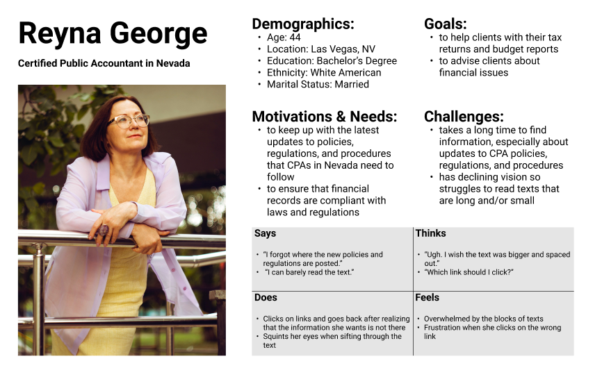
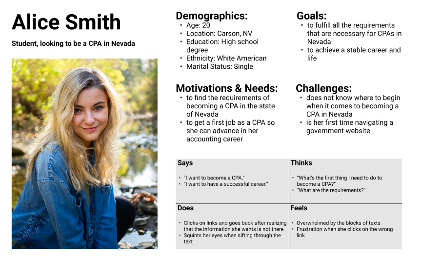

# UX Storytelling
### Ted Song | Digital Humanities 110: User Experience and Design

## The Purpose of UX Storytelling
The purpose of UX storytelling is to allow the designer to take on the perspective of the users.
Storytelling forces the designer to consider the feelings and experiences of the user, which helps the designer to filter out their biases.
One method of storytelling is creating personas, where the designer organizes the user's characteristics, goals, and sentiments.

## Proposed Features
- 

## Personas and Empathy Maps
### Persona 1: Reyna George

### Persona 2: Alice Smith

## Scenarios and Journey Maps
### Reyna George's Scenario and Journey Map
Reyna George is a certified public accountant (CPA) located in Nevada. She has been a CPA in Nevada for more than 10 years now. Every so often, there are new regulations and policies that CPAs need to follow, and the website for the Nevada State Board of Accountancy ([NVAccountany.com](NVAccountancy.com)) has all the information that she needs. Additionally, Reyna relies on the website to renew her CPA permit annually. So, this website is her go-to site when it comes to her job.

