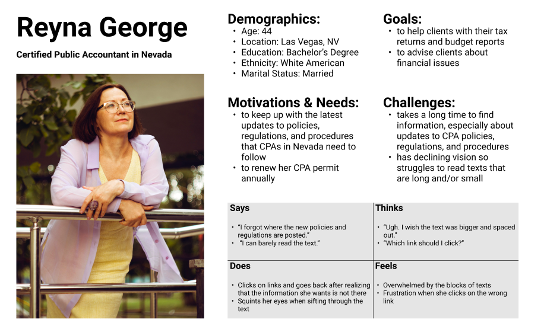
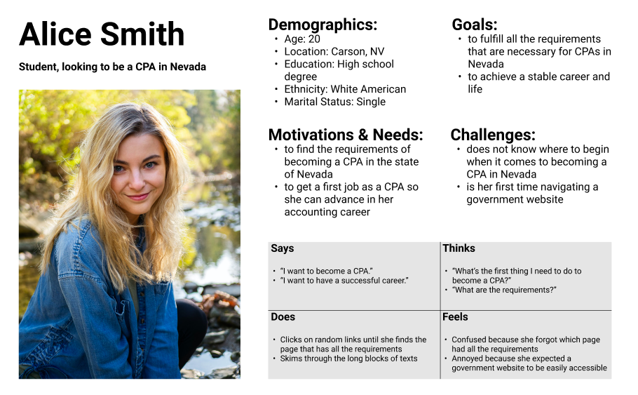

# UX Storytelling
### Ted Song | Digital Humanities 110: User Experience and Design

## The Purpose of UX Storytelling
The purpose of UX storytelling is to allow the designer to take on the perspective of the users.
Storytelling forces the designer to consider the feelings and experiences of the user, which helps the designer to filter out their biases.
One method of storytelling is creating personas, where the designer organizes the user's characteristics, goals, and sentiments.

## Proposed Features
- 

## Personas and Empathy Maps
### Persona 1: Reyna George

### Persona 2: Alice Smith

## Scenarios and Journey Maps
### Reyna George's Scenario and Journey Map
#### Why the website is used
- Reyna George is a certified public accountant (CPA) located in Nevada. She has been a CPA in Nevada for more than 10 years now. Every so often, there are new regulations and policies that CPAs need to follow, and the website for the Nevada State Board of Accountancy ([NVAccountany.com](NVAccountancy.com)) has all the information that she needs. Additionally, Reyna relies on the website to renew her CPA permit annually. So, this website is her go-to site when it comes to her job.

#### How the website can be used
- To find the updated regulations and policies, Reyna looks at the top menu bar clicks on "Regulations". This takes her to a website of Nevada's legistlation, which features a long list of laws that accountants must follow. Also, at the end of the year, Reyna needs to renew her permit, so she goes to the menu bar on the side and click on the "License Renewal" link under "Renewal / Compliance". Then, she clicks on the button to renew her license and then logs into her account.

### Alice Smith's Scenarios and Journey Map
#### Why the website is used
- Alice Smith is an economics student at a college in Nevada. She wants to become a CPA in Nevada and hopes that this will be a stepping block to her career. She needs to know the specific requirements to fulfill when it comes to being a CPA, so she relies on the website to get the educational and exam requirements. Additionally, she relies on the website to get information on what other steps she needs to take in order for her to become a CPA.

#### How the website can be used
- Every so often, Alice checks the website to see the steps she needs to take to become a CPA by clicking on the "CPA Exam Instructions" on the menu bar on the left side and reads through the instruction. She also uses the website when planning what classes she needs to take because she knows that certain classes are required to take the CPA Exam, so she clicks on "CPA Exam Educational Req." on the left menu bar and reads through the page to check which classes she has already taken and which classes she needs to take.
