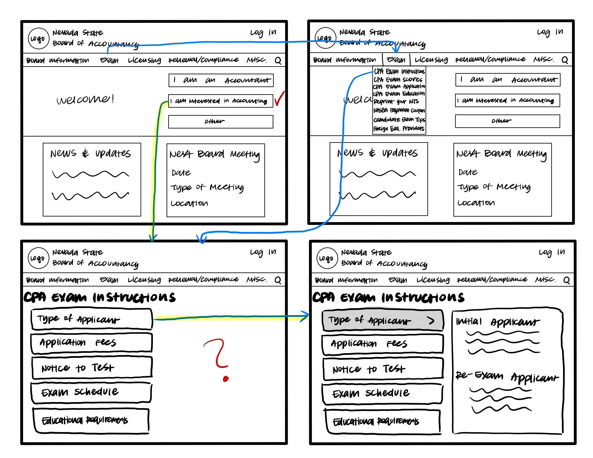

# Low Fidelity Prototype
### Ted Song | Digital Humanities 110: User Experience and Design

## Introduction
### User Research and Personas
User research indicated that the main problems of the [NV Accountancy](https://nvaccountany.com) had problems with text and organized. Users complained
about how the website used small texts which made it hard to read. Additionally, because there was so much text, the website also looked disorganized. Users had
a difficult time navigating the website. They felt that the website tried to include too much information. Additionally, the website had two features that appeared
to be menu bars but only one of them was actually a menu bar.

Two personas were used for the project. One persona was a Nevada student who wants to become a CPA but is unfamiliar with the
website and does not know where to go when it comes to finding information about requirements and exam. Another persona was a Nevada accountant who is familiar with the website but still finds the website inaccessible in that there
are problems when reading the small text and navigating the website.

## Purpose
The purpose of low fidelity prototypes is to have a quick, uncostly way of designing the layout of a potential website or app.
Additionally, low fidelity prototypes allow for users to go through the flow of a website or app, which then allows for designers to check whether their potential
design is usable, efficient, and helpful in the context of the user.

## Features to be Tested
One of the features that was tested is the use of a singular menu bar to navigate. User was instructed to find the exam instructions and the information about the
types of CPA applicants there are. User was also instructed to try to renew a CPA license and find the fees for renewal.

Another feature that was tested is better organization of information. A clickable box was used. When the box was clicked, the appropriate information would show up
on the right side of the screen. This would be tested by how the user reacted to the design.

## Wireframes

## Wireflows

## User Test

### Comments
#### Finding Exam Instructions
- User really liked that there was an introduction option where it said "I am interested in accounting." User felt that it was a very engaging way for new users to use the website, hence the check mark
- In fact, user didn't use the menu bar because using the introduction option was much easier.
- However, user was momentarily confused when there was a blank space on the right side of the page, hence the question mark.
- One concern that the user did tell me was that, although the exam instructions page was well organized, it felt that only a limited amount of information would be placed inside the box.
- User successfully completed the task.

#### Renewing License
- Based on the previous task, user tried to use the introduction option again. However, the user was stumped momentarily because they thought the "I am an accountant option" can be used for the task, but it wasn't. Thus, the user put a question mark next to the "I am an accountant" box.
- When looking through the Renewal/Compliance menu, the user looked through all the possible links. User mentioned that the links did not appear like they belonged under the Renewal/Compliance menu. This reaction is noted with the highlighter dots next to the links.
- User also asked me why the renewal link was not under licensing, which showed that links need to be properly connected to the menu features.
- User was surprised by the "Renew my license now" link. The user told me that it didn't match well with the overall organization of the website because it felt out of place.

## Reflection
The process went rather smoothly. However, this is because the website is simple to use and there weren't many screens that the user had to navigate. This also contributed to the quick nature of the user's test of the prototype. I think that next time, I should offer more complicated tasks for the user to navigate in the website. Also, the user offered points and concerns of design, so I will consider the user's comments and think of new potential designs and organization techniques to use for the next time I make a prototype. Also, when I was creating my wireframes, I mainly focused on the screens that my user was going to use, but this actually prevented the user from further exploring the website, so for next time, I intend to create more wireframe screens, even if the user is not likely to use them.
