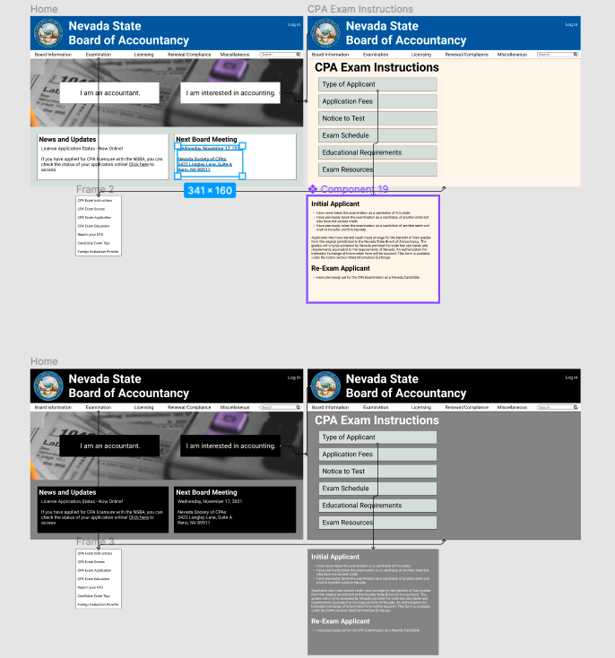
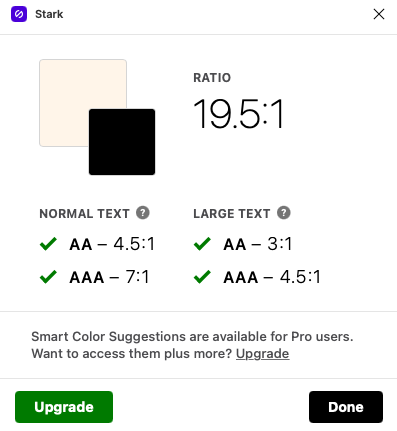

# Interface Design
### Ted Song | Digital Humanities 110: User Experience and Design

## Description
The purpose of this interface design is to test how the user reacts to a redesign of the Nevada State Board of Accountancy website.
Specifically, a singular menu bar at the top, links on the homepage that guide (new and experienced) users, and organized layout were newly incorporated into the redesign.
This interface design focuses on how a new user, who is interested in being a CPA in Nevada, would use the website.
The interface design involves the user to navigate to the Exam Instructions page where information about the CPA application and exam is provided.
To create this interface design, I started with low-fidelity wireframes and digitized the wireframes with Figma.

## Digitized Wireflow
[Link to Photo](Digitized_Wireflow.png)

## Variations
### Font
- [Bold 64-pt Roboto for the top website organization name](organization_name.png)
- [Regular 24-pt Roboto for normal text, 1.5 spacing](normal_text.png)
- [Regular 18-pt Roboto for information, 1.5 spacing](information.png)

### Shapes
- [528x115 boxes for the guide buttons](buttons.png)
- [Tabs fit to the size of the text](tabs.png)
- [Search bar with rounded corners](search.png)

### Color Schemes
Light Mode (top) and Dark Mode (bottom)

## Decision Making Process
I chose to use blue and a silver tones because those were the state colors for Nevada. I purposely made the guide buttons ("I am an accountant" and "I am interested in becoming an accountant") big because I wanted them to be the first thing that the user noticed. This would be especially useful for people who are not familiar with the website or have not used the website for a while. I also placed the menu bar near the top of the website and only used one menu bar (unlike the original) so that users would be familiar with looking up for the menu links. Additionally, this allowed for a more organized look. I also used a layout that used tabs and a page (see wireframe for Exam Instructions) to look more organized and usable. I felt that the user would be able to quickly know how to use the site.

## Impression Quotes
- "I like the blue color at the top. It goes well with the ideal government site."
- "The 'I am interested in becoming an accountant' button is right there for me to click."
- "I think that the font needs to be a bit bigger for the smaller texts in [the Exam Instructions] page."
- "The menu bar does look kinda weird. It needs to be better organized. It's awkward."
- "The photo is kinda bad."
- "Looks very organized."
- "Very simple."

I found that the user found the website to be very well organized. The user especially loved the color and thought it matched well with the website's purpose. The user seemed to also find the website very easy to navigate. However, there were minor design flaws noted by the user. For example, the tabs on the menu bar didn't feel centered, which did slightly bother the user. Additionally, the photo used in the homepage was reused from the original website, but I think it would be better to change it to a more fitting, colorful picture.

## Accessibility Check
Color Contrast Check

## Interface Design Page
[Link to Figma](https://www.figma.com/file/Mrv4X6ZWuVzkZExpDhd6Nw/High-Fidelity-Prototype?node-id=0%3A1)
