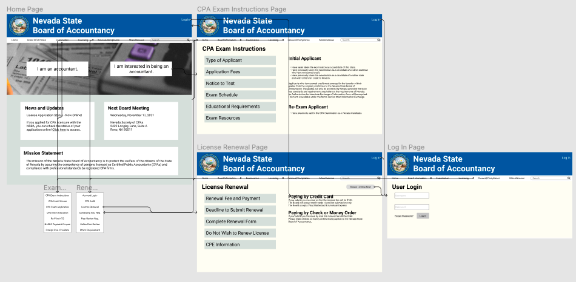

# High Fidelity Prototyping
### Ted Song | Digital Humanities 110: User Experience and Design

## Introduction
This project seeks to improve and enhance the user experience of the website for the Nevada State Board of Accountancy.
The current page is specifically for high-fidelity prototyping of the website.
High-fidelity prototyping allows for actually visualizing the information and components that will be present on the website and for checking
whether the proposed interaction flow works for the user.
In this process, the user will attempt to find the types of applicants there are for the CPA exam and to renew their CPA license.

## Tasks
- Finding the type of applicants for CPA Exam
- Renewing CPA license

## Wireflow

## Interactive Prototype
[Link to Interactive Prototype on Figma](https://www.figma.com/proto/nt8GbxuQnvFVY3Mw0T5Me4/High-Fidelity-Prototype-(Copy)?node-id=89%3A76&scaling=min-zoom&page-id=0%3A1&starting-point-node-id=117%3A29)

## Cognitive Walkthrough and Reflection
[Screen Recording of Walkthrough](https://drive.google.com/file/d/1x755kr9Qwqzc7ERAl0cwyyUukAhsEQfR/view?usp=sharing)

I think that the organized menu (compared to the original website) definitely did help the user with their navigation of the website. I felt that because the menu bar is usually at the top of numerous websites, the user automatically felt inclined to use it to go to the site that they desired to go to when doing both tasks. At the beginning of the walkthrough, the user was almost tempted to use the "I am interested in being an accountant" button, which signifies that these buttons are useful for new users. I think one design component that I can improve on is signals to users on which page they are in. I think the user was a bit confused when going to the CPA Exam Instructions page and License Renewal page because the page showed information, but the side didn't inform them which tab they were on. So, I think that arrows or using a different shade of tab color may help with this problem. I think it would also help to shade the menu tab if the user is on a certain page (i.e., so if the user is on a page under the "Examination" menu tab, then the "Examnination menu tab will be shaded).
