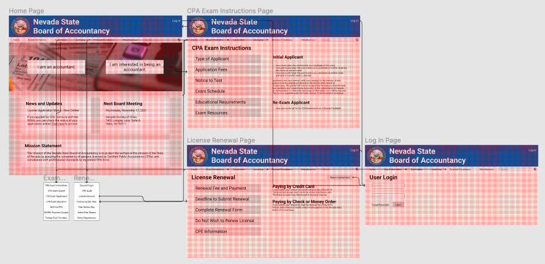

# High Fidelity Prototyping
### Ted Song | Digital Humanities 110: User Experience and Design

## Introduction
This project seeks to improve and enhance the user experience of the website for the Nevada State Board of Accountancy.
The current page is specifically for high-fidelity prototyping of the website.
High-fidelity prototyping allows for actually visualizing the information and components that will be present on the website and for checking
whether the proposed interaction flow works for the user.
In this process, the user will attempt to find the types of applicants there are for the CPA exam and to renew their CPA license.

## Tasks
- Finding the type of applicants for CPA Exam
- Renewing CPA license

## Wireflow

## Interactive Prototype
?node-id=117%3A29&scaling=min-zoom&page-id=0%3A1&starting-point-node-id=117%3A29&show-proto-sidebar=1)
